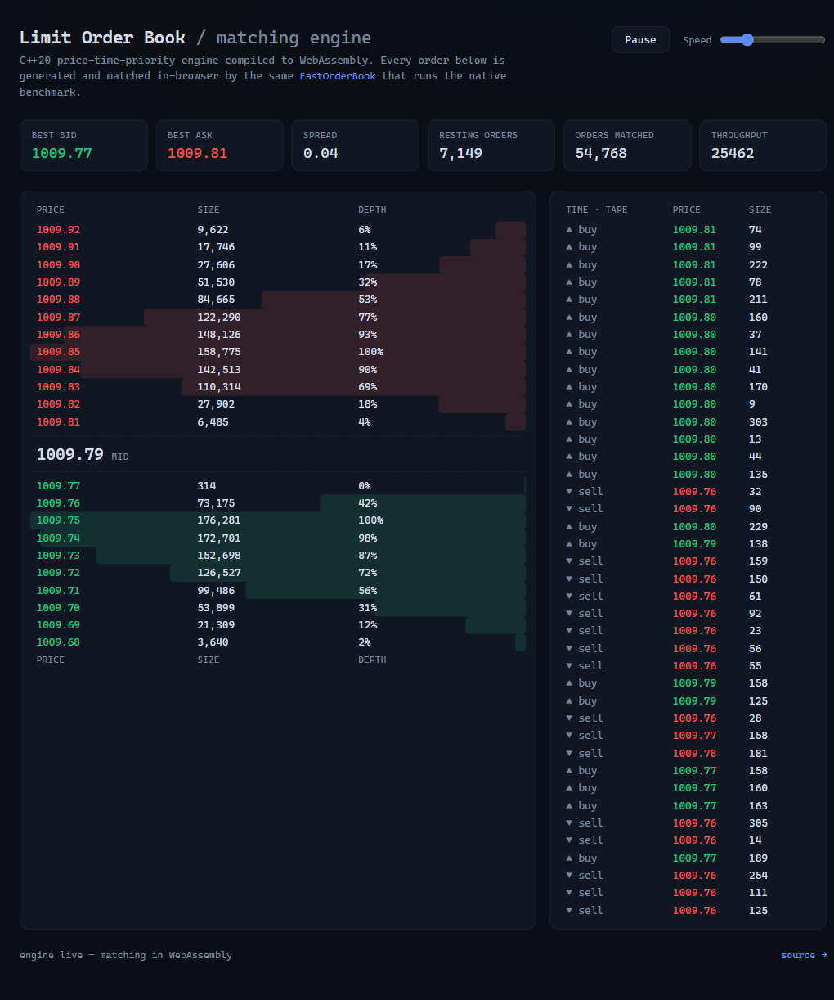

# Limit Order Book & Matching Engine (C++20)

A single-symbol limit order book with a **price-time-priority** matching engine,
written in modern C++. The goal is a core that is *correct first* and *fast
second*: correctness is validated against replayed real NASDAQ ITCH market data,
and throughput/latency are benchmarked phase by phase.

> **Status:** all five roadmap milestones are complete — a correctness-first
> naive book, ITCH replay validated against real NASDAQ data, a cache-friendly
> latency rewrite (~2.7× throughput), a reproducible benchmark, and a live
> WebAssembly browser demo. See the roadmap below.



*The C++ engine compiled to WebAssembly, matching a synthetic order flow live in
the browser — depth ladder, trade tape, and throughput. Build it under [web/](web/).*

## What it does

- Full order lifecycle: **add / cancel / modify / execute**
- **Limit** and **market** orders, with partial fills
- Strict **price-time (FIFO) priority** — best price first, then arrival order
- Trades print at the resting (maker) price; aggressors cross the spread
- O(1)-average cancel/modify via an order-id index

## Design notes

- **Integer prices.** Prices are integer ticks, never floating point, so
  comparison and equality on the price grid are exact.
- **Maker-priced executions.** The order resting first sets the trade price; the
  incoming order crosses to it.
- **Modify semantics.** Reducing quantity at the same price keeps time priority
  (edited in place); increasing quantity or changing price loses priority
  (cancel + re-insert, which may cross and trade).
- The Milestone-1 book uses ordered `std::map` price levels and `std::list`
  FIFO queues. This is deliberately the simple, obviously-correct structure; it
  is the reference the later cache-friendly rewrite must match exactly.

## Build & test

Requires a C++20 compiler and CMake ≥ 3.20. GoogleTest is fetched automatically.

```sh
cmake -S . -B build -G Ninja -DCMAKE_BUILD_TYPE=Release
cmake --build build
ctest --test-dir build --output-on-failure
```

### Validating against real market data

The unit tests replay synthetic, spec-accurate ITCH streams, so correctness is
proven with no download. To additionally cross-check against a *real* NASDAQ
session, fetch a prefix of a published TotalView-ITCH 5.0 file and diff the C++
reconstruction against the independent Python reference:

```sh
python scripts/fetch_itch.py --date 12302019 --mb 32   # -> data/itch_sample.bin
python scripts/validate_itch.py --cpp build/itch_validate   # rebuilds + diffs
```

A `MATCH` line means the two independent reconstructions produced identical depth
snapshots — real evidence of correctness, not a shared bug.

## Roadmap

1. ✅ **Correct book, naive structures** — full lifecycle, unit-tested against hand-worked scenarios.
2. ✅ **ITCH replay + validation** — parses NASDAQ TotalView-ITCH 5.0, rebuilds the book, and diffs byte-for-byte against an independent Python reference reconstruction. Verified on real feed data (2.8 M messages) plus synthetic-stream unit tests.
3. ✅ **Latency rewrite** — `FastOrderBook`: intrusive order pool + flat O(1) price-ladder array + 64-byte-aligned levels. Proven byte-for-byte identical to the naive book by a randomised differential test.
4. ✅ **Optimization pass** — reproducible throughput + p50/p99/p99.9 latency benchmark (`bench`); the rewrite lands **~2.7× throughput** over the naive book. See [BENCHMARKS.md](BENCHMARKS.md).
5. ✅ **Live demo** — the engine compiled to WebAssembly, matching a live synthetic order flow in the browser (depth ladder + trade tape). See [web/](web/).

## Layout

```
include/lob/       public headers (types, order, trade, order_book, fast_order_book)
include/lob/itch/  ITCH 5.0 decoder + book reconstructor
include/lob/bench/ latency histogram utility
src/               matching-engine implementations (naive + fast)
src/itch/          ITCH reconstruction
apps/              itch_validate (reconstruction tool) + bench (benchmark harness)
scripts/           ITCH fetch + Python reference reconstructor + cross-validator
tests/             GoogleTest unit + differential tests
data/              ITCH sample data (downloaded separately, git-ignored)
```
